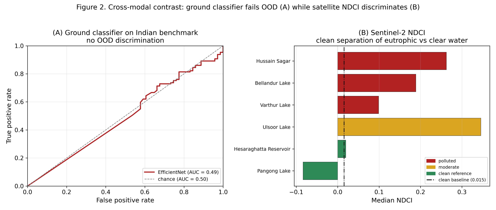
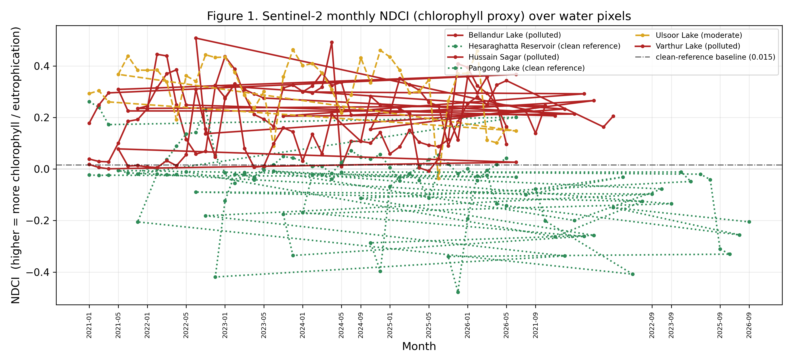
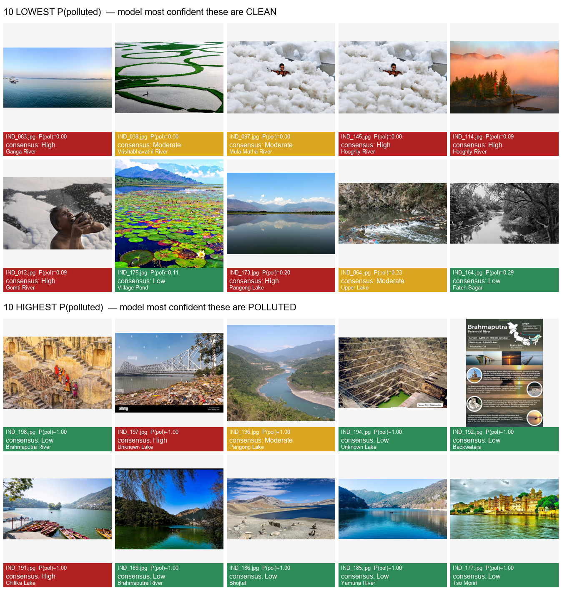

# AquaWatch: A Cross-Modal Citizen-Science System for Water-Pollution Triage with Honest Out-of-Distribution Validation and Sentinel-2 Corroboration

**Pallavi K R¹, Bhoomi Prashanth Nayak², Hrithika Vishwanath Shetty³, Sonika G K⁴, Varsha H L⁵**
Department of Computer Science and Engineering, Sir M Visvesvaraya Institute of Technology, Bengaluru, India

---

## Abstract

Urban lakes, ponds, and streams in rapidly developing cities such as Bengaluru, India, are increasingly affected by pollution and inadequate monitoring. The large number of water bodies makes frequent manual inspection difficult, motivating affordable and scalable methods. This paper presents AquaWatch, a citizen-centric platform in which users submit GPS-tagged photographs of water bodies through a mobile application and receive an automated pollution-risk estimate. The ground pipeline combines a seven-factor computer-vision (CV) analysis (Forel–Ule colour, algae, foam, turbidity, oil sheen, colour abnormality, and floating debris) with two learned models — an EfficientNet-B0 binary classifier and a YOLOv8n-seg segmentation model — fused into a 0–100 risk score classified as Low, Moderate, or High. Crucially, rather than reporting only in-distribution accuracy, we construct a human-annotated Indian water benchmark (N = 200; three annotators; Fleiss κ = 0.76 severity, 0.80 binary) and evaluate every component on it. We find a severe out-of-distribution (OOD) failure: a classifier that attains 99.9 % on a leakage-controlled in-distribution validation set collapses to chance discrimination (ROC-AUC ≈ 0.49) on real Indian imagery, and post-hoc threshold recalibration (5-fold Youden's J) does not repair it. Motivated by this, we add an independent Sentinel-2 corroboration layer (via Google Earth Engine) that computes the Normalized Difference Chlorophyll Index (NDCI) over water-masked pixels; NDCI cleanly separates eutrophic urban lakes from clean-reference controls where the image classifier fails. Each report is linked to a nearby water body via PostgreSQL/PostGIS (500 m) and the satellite verdict is produced asynchronously. We present the system design, benchmark, experimental protocol, honest results, and limitations, and argue that the appropriate role of ground imagery is triage while satellite indices provide physical corroboration.

**Keywords—** citizen science, water pollution monitoring, computer vision, out-of-distribution generalization, EfficientNet, Sentinel-2, NDCI, Forel–Ule colourimetry, geospatial analysis, mobile crowdsourcing.

---

## I. Introduction

Remote sensing is widely used to observe water quality across large areas; reviews of satellite methods report useful estimation of chlorophyll-a, turbidity, and coloured dissolved organic matter, while noting practical issues such as cloud interference, mixed pixels, calibration, and difficulty monitoring small water bodies [1]. Optical and sensor systems can support automated monitoring but emphasize measurement uncertainty [2] and depend on installed hardware [6]. Aerial AI approaches detect floating waste from drone imagery but are not evaluated on ground-level citizen photographs [4]. Integrations of remote sensing, IoT, and GIS improve coverage [5] yet rarely incorporate citizen-submitted images or CV-based risk assessment.

A distinct and under-examined risk in image-based citizen monitoring is generalization: a model trained on one image distribution may perform well in validation yet fail on field imagery from a different region. Prior citizen/vision systems seldom quantify this gap on an independent, locally labelled benchmark. This paper treats that gap as a first-class research question.

The main contributions of this work are:

- A citizen mobile application for submitting GPS-tagged water-body images and an operational FastAPI/PostGIS backend that links each report to a nearby water body.
- A seven-factor CV pipeline combined with two learned models (EfficientNet-B0 classifier; YOLOv8n-seg) producing a calibrated 0–100 risk score (Low/Moderate/High).
- A curated Indian water benchmark (N = 200) with three independent annotators and substantial inter-rater agreement (Fleiss κ = 0.76/0.80), used strictly for evaluation.
- An honest out-of-distribution analysis showing that a 99.9 %-in-distribution classifier collapses to ROC-AUC ≈ 0.49 on Indian water, that an ensemble merely matches the base rate, and that threshold recalibration is insufficient — a cautionary, reproducible negative result.
- A Sentinel-2 corroboration layer (Google Earth Engine) computing NDCI over NDWI-masked water pixels, delivered as an asynchronous per-report verdict, which separates eutrophic from clear water where the image model fails.

The remainder of the paper is organized as follows. Section II reviews related work. Section III describes the methodology and system architecture. Section IV presents the benchmark, experimental protocol, and results. Section V discusses limitations and future work. Section VI concludes.

---

## II. Literature Review

### A. Laboratory and chemical monitoring
Traditional monitoring relies on laboratory/field measurement of BOD, dissolved oxygen, pH, nitrates, and coliforms to compute Water Quality Index values [16], and on chemical assays of hydrocarbons, heavy metals, and pharmaceuticals [8], [19], [20]. These give detailed, authoritative measurements but require sampling and lab facilities, limiting continuous large-scale coverage.

### B. Sensor and IoT-based monitoring
IoT systems continuously measure pH, turbidity, dissolved oxygen, nutrient runoff, and cyanobacterial blooms [9], [15], [21], [23], but coverage is limited to instrumented sites [6], [18].

### C. Remote sensing and GIS
Satellite/GIS approaches monitor surface water over large regions [11], [13], [14], and AI has been applied to remote-sensing data for water-body detection and quality estimation [14]. Spectral indices such as NDWI for water delineation [27] and NDCI for chlorophyll [26] are well established, but depend on resolution and, for absolute quantities, in-situ calibration [1], [19].

### D. AI and data-driven monitoring
Machine learning is increasingly applied to environmental sensing and remote-sensing data [14], [18], [22]. However, most systems use sensor or satellite inputs rather than citizen ground-level imagery, and — importantly — rarely report generalization to an independent, locally labelled test set.

### E. Research gap
Existing work spans lab/chemical [8], [16], [19], [20], sensor/IoT [9], [15], [21], [23], remote sensing/GIS [11], [13], [14], and AI-based analysis [14], [18], [22]. Two gaps remain: (i) integrating citizen ground-level photographs, CV/ML risk estimation, geospatial association, and web visualization in one platform; and (ii) honestly quantifying whether image-based classifiers generalize to local field imagery, and what to do when they do not. AquaWatch addresses both — the first with an end-to-end system, the second with a locally annotated benchmark and a cross-modal satellite corroboration layer.

---

## III. Methodology

### A. System design and architecture
Users capture a water-body image in the Flutter app and provide GPS location, contamination type, and optional notes; the request is sent to a FastAPI backend (`/api/v1`). The image is analysed by the seven-factor CV pipeline and by two learned models, fused into a risk score. The report is stored in PostgreSQL and linked by PostGIS to the nearest known water body within 500 m. A satellite corroboration verdict is then computed asynchronously and attached to the report. Results are served to a Leaflet dashboard and the mobile result view.

### B. Mobile data collection and GPS
The Flutter application guides users to capture a suitable image (fill frame with water, avoid glare), records GPS coordinates, and submits image plus metadata with retry handling. GPS enables spatial association and mapping.

### C. Seven-factor computer-vision pipeline
Using OpenCV, each image yields seven indicators: Forel–Ule colour (21-point limnological scale), algae (green-hue fraction in HSV), foam (bright low-saturation blob/contour analysis), turbidity (Laplacian variance with a dark-water penalty), oil sheen (rainbow iridescence via local hue variance plus thick-slick detection), colour abnormality (statistical distance from natural water colours), and surface debris (contour density). These are combined with fixed weights (turbidity 0.18, foam 0.18, debris 0.17, algae 0.15, colour abnormality 0.15, Forel–Ule 0.10, oil 0.07) into a composite score S ∈ [0, 100], classified Low (0–15), Moderate (16–35), High (36–100).

### D. Learned models and fusion
EfficientNet-B0 [24] (ImageNet-initialised, two-class head) is fine-tuned on the EyeOnWater citizen dataset (22,376 images; 12,357 clean / 10,019 polluted). To prevent near-duplicate leakage, images are clustered by perceptual hash and split group-aware (20,907 clusters; minimum cross-split Hamming distance 12; no leakage), yielding a leakage-controlled validation accuracy of 0.9988. YOLOv8n-seg [25] is trained on a river-water segmentation set (949 images; clean/turbid/polluted; in-domain mAP@0.5 = 0.836). At inference, EfficientNet acts as the primary authority and YOLO provides a bounded boost only when the classifier agrees; a CV safety net forces High risk on strong visual indicators (e.g., foam or debris coverage > 30 %).

### E. Geospatial processing
PostgreSQL stores water bodies, reports, and historical risk snapshots; PostGIS performs proximity matching with `ST_DWithin` on geography-cast POINT geometries (SRID 4326). A new report is associated with the nearest water body within 500 m, or a new record is created, so nearby observations accumulate into one monitoring history.

### F. Sentinel-2 corroboration layer
Sentinel-2 L2A imagery (`COPERNICUS/S2_SR_HARMONIZED`) is accessed through Google Earth Engine [28]. Cloud/shadow pixels are removed via the Scene Classification Layer, and two indices are computed:

- Water mask (McFeeters NDWI [27]): NDWI = (B3 − B8) / (B3 + B8), keeping NDWI > 0.
- Chlorophyll proxy (NDCI [26]): NDCI = (B5 − B4) / (B5 + B4), averaged over water-masked pixels at 20 m.

Two tiers are provided. A cached tier precomputes monthly NDCI series (2021–present) for tracked lakes, yielding per-lake median/75th-percentile statistics. An on-demand tier handles arbitrary user GPS: it buffers the point (escalating 150 → 300 → 500 m to reach open water on weed-choked shorelines), builds an SCL-masked median composite over a 180-day window (monsoon-tolerant, since single <20 %-cloud scenes are unavailable for months in Bengaluru), enforces a minimum water-pixel gate to reject sub-pixel targets, and compares NDCI to a fixed clean-reference baseline. Because no in-situ chlorophyll is available, scoring is relative (versus clean references and a lake's own history), never absolute. The satellite verdict (elevated/watch/nominal/unavailable) is computed asynchronously (FastAPI `BackgroundTasks`) so it never blocks report submission; clients poll the report until the verdict resolves. The satellite signal is deliberately not probabilistically fused with the image classifier — blending a chance-level signal would only add noise — but is presented as independent physical corroboration.

### G. Dashboard
A Leaflet.js dashboard (HTML/CSS/JS, no build step) maps water bodies coloured by risk category, with per-water-body detail (score, factor breakdown, recent reports, and satellite badge) and periodic refresh.

---

## IV. Results and Implementation

The platform is implemented with a Flutter app, a FastAPI backend, OpenCV/PyTorch analysis, PostgreSQL/PostGIS storage, GEE-based satellite analysis, and a Leaflet dashboard. Beyond functional testing of the reporting workflow, we conduct a quantitative evaluation on an independent benchmark.

### A. Indian water benchmark
We assembled 200 real Indian water-body images spanning lakes, rivers, drains, and reservoirs across multiple cities. Three annotators independently labelled each image on a three-level severity scale (0 = Low, 1 = Moderate, 2 = High); the consensus is the per-image majority (all resolvable). Distribution: 71 Low, 75 Moderate, 54 High. Inter-rater agreement is substantial: Fleiss κ = 0.757 (three-class) and 0.795 (binary Low vs Moderate+High) [29]. The benchmark is used only for evaluation; no model is trained on it.

### B. Component ablation (binary: clean vs polluted; base rate 64.5 %)

| Model | Accuracy | Precision | Recall | F1 |
|---|---|---|---|---|
| CV-only | 56.5 % | 61.7 % | 86.1 % | 71.8 % |
| EfficientNet-only | 61.0 % | 63.5 % | 93.0 % | 75.5 % |
| YOLO-only | 43.8 % | 68.0 % | 30.1 % | 41.7 % |
| Ensemble | 64.5 % | 64.6 % | 99.2 % | 78.3 % |

Three-class (Low/Moderate/High): CV-only 32.0 % (macro-F1 22.8 %); Ensemble 27.0 % (macro-F1 18.6 %) — at or below the 37.5 % majority-class baseline. The ensemble's 64.5 % accuracy equals the base rate, with precision ≈ base rate and recall 99.2 %: it predicts "polluted" almost always rather than discriminating.

### C. Out-of-distribution failure and threshold recalibration
The classifier's threshold-independent ROC-AUC on the benchmark is 0.49 (chance), and the correlation between predicted pollution probability and true severity is −0.12 (weakly inverted). Under the default threshold τ = 0.5, sensitivity is 93.0 % but specificity only 2.8 %. Recalibrating with 5-fold stratified cross-validation and Youden's J [30] (τ* = argmax(sensitivity + specificity − 1)) raises specificity to 32.4 % but reduces accuracy to 55.0 % ± 3.5 % and F1 to 65.8 % — trading errors along a diagonal ROC. The in-distribution-to-benchmark accuracy gap is 99.9 % → 55.0 % (≈ 45 pp). Qualitatively (Fig. 8), the images the model is most confident are clean are predominantly labelled High by humans, and vice-versa. We conclude that the failure is representational, not a calibration artifact; post-hoc thresholding cannot repair a model lacking discriminative signal on this domain.

**Fig. 6.** Cross-modal contrast. (A) The ground classifier's ROC curve on the Indian benchmark hugs the chance diagonal (AUC ≈ 0.49); (B) Sentinel-2 NDCI cleanly separates eutrophic urban lakes from clean-reference controls relative to the clean baseline.

### D. Sentinel-2 corroboration
Monthly-median NDCI over the study water bodies:

| Water body | Category | Median NDCI |
|---|---|---|
| Hussain Sagar | polluted | 0.263 |
| Ulsoor | moderate | 0.346 |
| Bellandur | polluted | 0.189 |
| Varthur | polluted | 0.099 |
| Hesaraghatta | clean reference | 0.020 |
| Pangong | clean reference | −0.084 |

Clean references anchor low (Pangong negative, indicating clear oligotrophic water), and every urban lake sits above the ≈ 0.0155 clean-reference baseline. NDCI thus separates high-chlorophyll from clear water — the discrimination the ground classifier could not achieve (Fig. 7). We note NDCI measures chlorophyll/eutrophication specifically (hence the intensely eutrophic small lake Ulsoor reads highest), so it is reported as a chlorophyll axis, not a general pollution rank; the frequently low/dry Hesaraghatta reservoir sits essentially at the baseline.

**Fig. 7.** Sentinel-2 monthly NDCI time-series (2021–present) per water body, with the clean-reference baseline. Polluted urban lakes remain elevated relative to the clean controls across seasons.

**Fig. 8.** Qualitative out-of-distribution inversion. The ten images the classifier is most confident are "clean" (top) versus most confident are "polluted" (bottom), captioned with the human consensus label; the model's confidence is anti-correlated with the ground truth.

### E. Functional system
The mobile app produces per-report results (composite score, level, factor breakdown, AI classification) and displays the asynchronously populated satellite verdict; the dashboard maps water bodies by risk with detail panels and satellite badges. An example report yields a composite score of 40.5/100 (High) with its factor breakdown, alongside a satellite verdict rendered once the background query resolves.

---

## V. Limitations and Future Work

1. Small benchmark (N = 200). Confidence intervals are wide; we mitigate with cross-validation and report variance.
2. Label boundary. "Low" images are often visibly degraded urban water, so the binary task is honestly low-vs-high pollution rather than pristine-vs-polluted.
3. Image licensing / provenance. Only CC-licensed imagery is redistributable; scraped evaluation images are reported with source URLs.
4. Satellite resolution. At 10–20 m, corroboration applies only to sufficiently large water bodies; drains, ponds, and thin rivers are sub-pixel and return "unavailable."
5. No in-situ ground truth. NDCI is relative, not an absolute chlorophyll measurement; results are corroborative.
6. Domain gap. The primary future direction is in-domain training data (including genuinely clean Indian water) rather than post-hoc tuning; the classifier should be re-evaluated after fine-tuning.
7. Operational. On-demand satellite queries run as in-process background tasks; a production deployment should use a task queue, and lake polygons should be tightened before publication.

---

## VI. Conclusion

AquaWatch is a deployable citizen-science platform that combines mobile image collection, a seven-factor CV pipeline, learned classifiers, geospatial association, and web visualization, together with an independent Sentinel-2 corroboration layer. Its principal scientific contribution is honesty: on a locally annotated benchmark, an image classifier with 99.9 % in-distribution accuracy is shown to collapse to chance (ROC-AUC ≈ 0.49) out-of-distribution, and threshold recalibration cannot recover it — while satellite NDCI reliably separates eutrophic from clear water. The appropriate role for ground imagery is therefore preliminary triage, with satellite indices providing physical corroboration for large water bodies. Future work will pursue in-domain training data, in-situ validation, and broadened spatial coverage.

---

## References

Existing team references [1]–[23] are retained as in the current manuscript. Additional references introduced by the new methodology:

[24] M. Tan and Q. V. Le, "EfficientNet: Rethinking Model Scaling for Convolutional Neural Networks," in Proc. ICML, 2019. arXiv:1905.11946.

[25] G. Jocher, A. Chaurasia, and J. Qiu, "Ultralytics YOLOv8," 2023. [Online]. Available: https://github.com/ultralytics/ultralytics

[26] S. Mishra and D. R. Mishra, "Normalized difference chlorophyll index: A novel model for remote estimation of chlorophyll-a concentration in turbid productive waters," Remote Sensing of Environment, vol. 117, pp. 394–406, 2012, doi: 10.1016/j.rse.2011.10.016.

[27] S. K. McFeeters, "The use of the Normalized Difference Water Index (NDWI) in the delineation of open water features," Int. J. Remote Sensing, vol. 17, no. 7, pp. 1425–1432, 1996, doi: 10.1080/01431169608948714.

[28] N. Gorelick, M. Hancher, M. Dixon, S. Ilyushchenko, D. Thau, and R. Moore, "Google Earth Engine: Planetary-scale geospatial analysis for everyone," Remote Sensing of Environment, vol. 202, pp. 18–27, 2017, doi: 10.1016/j.rse.2017.06.031.

[29] J. L. Fleiss, "Measuring nominal scale agreement among many raters," Psychological Bulletin, vol. 76, no. 5, pp. 378–382, 1971, doi: 10.1037/h0031619.

[30] W. J. Youden, "Index for rating diagnostic tests," Cancer, vol. 3, no. 1, pp. 32–35, 1950.

Note: verify all DOIs/venues against the final reference manager before submission.
